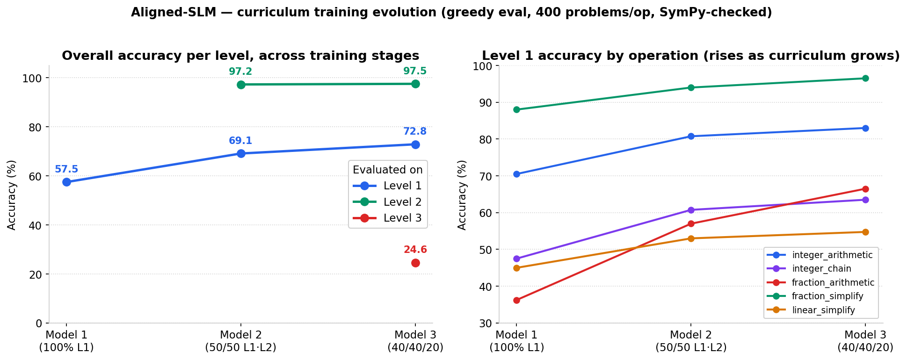

# Aligned-SLM

A character-level language model trained **from scratch** to do step-by-step
mathematics, then progressively taught harder material through a curriculum — and
finally **aligned with DPO** so it prefers correct reasoning over incorrect
reasoning. The alignment step is a careful **negative-leaning result**: DPO helps
only under sampling and only slightly, and the [DPO section](#dpo-alignment)
diagnoses exactly why.

The project has one property that makes it unusually clean to study: **every
answer is verifiable with SymPy**. That single fact drives the whole pipeline —
data is generated and checked automatically, models are scored per-operation
automatically, and preference data for alignment is labelled automatically with no
human annotation.



*Left: overall accuracy on each level as training progresses through the three
stages. Right: Level 1 accuracy broken down by operation — every operation
improves even as Level 1's share of the data shrinks. See [Results](#results).*

---

## What the model is

A small GPT-style decoder, implemented from scratch in [`models/`](models/):

| Component        | Choice                                                        |
| ---------------- | ------------------------------------------------------------- |
| Tokenizer        | Character-level, vocab **56** (`a–z 0–9 * + - / ^ = ( ) …` + `<bos>/<eos>/<unk>`) |
| Dimensions       | `d_model=384`, `n_layers=12`, `n_heads=6`, context `1024`     |
| Block            | Pre-LayerNorm, causal multi-head self-attention, 4× ReLU FFN  |
| Positions        | Learned positional embeddings                                 |
| Inference        | KV-cache for O(n) decoding                                    |
| Size             | **~21.7M parameters**                                         |

Everything the model reads and writes is a string of characters in one format:

```
<bos>Problem: <question>; step: <step_1>; step: <step_2>; step: <final answer><eos>
```

The final answer is the text after the **last** `step:`. There is no separate
"answer" token — reasoning and answer are one continuous character stream, and the
model learns chain-of-thought by imitation.

---

## The data: a verifiable math curriculum

Problems are generated procedurally in [`Generating_data/`](Generating_data/), and
**every generated sample is checked with SymPy** — each intermediate step and the
final answer must be algebraically equal to the original expression, or the sample
is re-rolled. Difficulty is organized into three levels:

| Level | Focus                                                              | Example operations |
| ----- | ----------------------------------------------------------------- | ------------------ |
| **1** | Core syntax & arithmetic                                          | integer arithmetic, integer chains, fraction arithmetic, fraction simplification, linear simplification |
| **2** | Polynomials, distribution, linear solving                        | polynomial expand/sum, distributive, mixed chains, linear solve |
| **3** | Mixed polynomial simplification & fractional distribution        | mixed polynomial, fraction distribute |

---

## Training: curriculum by continued fine-tuning

Three checkpoints were trained, each **initialized from the previous one** and
trained on a progressively harder mixture (mixtures are built by
[`dataset_mix.py`](dataset_mix.py), which draws a weighted blend of the level
datasets):

| Model       | Initialized from | Data mixture              | LR     | Epochs |
| ----------- | ---------------- | ------------------------- | ------ | ------ |
| **Model 1** | scratch          | 100% Level 1              | 3e-4   | 20     |
| **Model 2** | Model 1          | 50% Level 1 · 50% Level 2 | 2e-4   | 20     |
| **Model 3** | Model 2          | 40% Level 1 · 40% Level 2 · 20% Level 3 | 1e-4 | 20 |

The learning rate is lowered at each stage, since each model starts from an
already-competent checkpoint rather than from noise.

---

## Results

All numbers below are from the Weights & Biases runs: **greedy decoding
(temperature 0), 400 freshly-generated problems per operation**, with answers
checked by SymPy (so `2*x + 7` and `7 + 2*x` both count as correct). Each model was
evaluated on **the levels it was trained on**.

### Level 1 — accuracy (%) as the curriculum grows

| Operation            | Model 1 | Model 2 | Model 3 |
| -------------------- | :-----: | :-----: | :-----: |
| integer_arithmetic   |  70.50  |  80.75  | **83.00** |
| integer_chain        |  47.50  |  60.75  | **63.50** |
| fraction_arithmetic  |  36.25  |  57.00  | **66.50** |
| fraction_simplify    |  88.00  |  94.00  | **96.50** |
| linear_simplify      |  45.00  |  53.00  | **54.75** |
| **Overall**          | **57.45** | **69.10** | **72.85** |

> **Positive transfer, no forgetting.** Level 1's share of the training data fell
> from 100% → 50% → 40%, yet Level 1 accuracy *rose on every single operation*.
> Learning harder material made the model better at the easy material.

### Level 2 — accuracy (%)

| Operation          | Model 2 | Model 3 |
| ------------------ | :-----: | :-----: |
| polynomial_expand  |  100.0  |  100.0  |
| polynomial_sum     |  92.00  |  93.00  |
| distributive       |  100.0  |  100.0  |
| mixed_chain        |  94.50  |  94.50  |
| linear_solve       |  99.75  |  100.0  |
| **Overall**        | **97.25** | **97.50** |

> **Mastered and retained.** Level 2 was essentially solved by Model 2, and
> introducing Level 3 did not regress it — Model 3 held 97.5%.

### Level 3 — accuracy (%) (Model 3 only)

| Operation           | Model 3 |
| ------------------- | :-----: |
| mixed_polynomial    |  26.00  |
| fraction_distribute |  23.25  |
| **Overall**         | **24.62** |

> **The frontier.** Level 3 — multi-step polynomial simplification and fractional
> distribution — sits at ~25%. This is the hardest, most compositional material,
> and it's where the next step is aimed.

### The story in one line

| Level tested | Model 1 | Model 2 | Model 3 |
| ------------ | :-----: | :-----: | :-----: |
| Level 1      | 57.45   | 69.10   | 72.85   |
| Level 2      | —       | 97.25   | 97.50   |
| Level 3      | —       | —       | 24.62   |

The single-step operations (integer arithmetic, fraction simplify, polynomial
expand, distributive) are essentially solved. The **multi-step / compositional**
operations lag at every level — `integer_chain` and `linear_simplify` in Level 1,
`mixed_chain` in Level 2, and both Level 3 operations. Chained reasoning is the
consistent weak point, and it is what the [DPO alignment](#dpo-alignment) step
targets.

---

## DPO alignment

**Model 3** was aligned with **Direct Preference Optimization (DPO)** — teaching it
to *prefer* correct chains over incorrect ones — producing **Model 4**
([`checkpoints/model_4.pt`](checkpoints/)). The tooling:

- [`Generating_data/generate_dpo_data.py`](Generating_data/generate_dpo_data.py) —
  samples several chains per problem at temperature 1.0, checks each with the same
  SymPy verifier used for evaluation, and pairs a **correct** chain (`chosen`)
  against a **wrong** one (`rejected`). No human labels — the verifier *is* the
  labeller.
- [`train_dpo.py`](train_dpo.py) — optimizes the DPO loss against a frozen copy of
  Model 3 as the reference.

| DPO setting          | Value                                             |
| -------------------- | ------------------------------------------------- |
| Reference / start    | Model 3 (a frozen copy is the reference)          |
| Preference pairs     | **634** — Level 1: 403 · Level 2: 98 · Level 3: 133 |
| Epochs / batch size  | 3 / 8                                              |
| β / label smoothing  | 0.1 / 0.0                                          |
| Learning rate        | 1e-5 → 1e-6 (cosine), 50 warmup steps             |

### The result in one line

> **DPO helped only under sampling, and only slightly.** Under greedy decoding
> (the deployed metric) it is flat. Under temperature-1 sampling — the same regime
> the preference pairs were drawn from — it gives a small, consistent gain on the
> levels with headroom. The gain is *small* because the preference data is weak, and
> the section below shows exactly why.

### Downstream accuracy — greedy (T=0) vs sampling (T=1)

Both evaluations use **400 freshly-generated problems per operation**, SymPy-checked.
The T=1 comparison is **paired** (seed 42 → both models see identical problems and
identical sampling noise), so the before/after delta is not confounded by problem
draw.

**Greedy decoding (T = 0) — how the model is actually deployed:**

| Level tested | Model 3 | Model 4 (DPO) |    Δ    |
| ------------ | :-----: | :-----------: | :-----: |
| Level 1      |  72.85  |     72.80     |  −0.05  |
| Level 2      |  97.50  |     97.65     |  +0.15  |
| Level 3      |  24.62  |     23.50     |  −1.12  |

> **Flat.** Every delta is inside evaluation noise. Under greedy decoding, DPO
> changed essentially nothing.

**Sampling (T = 1) — the regime the preference pairs came from:**

| Level tested | Model 3 | Model 4 (DPO) |    Δ    | 95% CI |
| ------------ | :-----: | :-----------: | :-----: | :----: |
| Level 1      |  65.65  |     67.75     | **+2.10** | ±2.08 |
| Level 2      |  96.25  |     96.70     |  +0.45  | ±0.83  |
| Level 3      |  16.75  |     19.50     | **+2.75** | ±2.59 |

> **A small but consistent gain where there is headroom.** On Level 1 *all five
> operations improve* (a sign test on that alone is p ≈ 0.03); Level 2 is saturated
> so there is nothing to gain; Level 3's `fraction_distribute` jumps **+6.5**. The
> design is paired, so the true confidence interval on the difference is tighter
> than the single-proportion ±CI shown.

Per-operation, T = 1 — **Level 1** (all five improve):

| Operation           | Model 3 | Model 4 (DPO) |   Δ   |
| ------------------- | :-----: | :-----------: | :---: |
| integer_arithmetic  |  76.75  |     78.75     | +2.00 |
| integer_chain       |  58.75  |     60.25     | +1.50 |
| fraction_arithmetic |  52.25  |     55.50     | +3.25 |
| fraction_simplify   |  90.00  |     90.50     | +0.50 |
| linear_simplify     |  50.50  |     53.75     | +3.25 |

Per-operation, T = 1 — **Level 3**:

| Operation           | Model 3 | Model 4 (DPO) |   Δ   |
| ------------------- | :-----: | :-----------: | :---: |
| mixed_polynomial    |  21.75  |     20.75     | −1.00 |
| fraction_distribute |  11.75  |     18.25     | +6.50 |

### Why the gain is small — and why greedy hides it

Two findings explain the whole picture.

**1. The T0/T1 split is a decoding-mismatch signature.** The preference pairs are
the model's *sampling* mistakes (drawn at T=1). DPO pushes probability mass off
those stochastic slips — which shows up when you sample (T=1: +2–3pp) but not when
you decode greedily (T=0: ≈0), because greedy already takes the argmax path that
routes *around* those slips. So the alignment did something real; greedy evaluation
just can't see it.

**2. The preference pairs are degenerate, which caps the gain.** Inspecting the 634
pairs:

- **57%** of `chosen`/`rejected` pairs differ by a **single token**;
- **77%** differ by ≤2 tokens;
- **61%** are identical except for the **final step**.

A representative pair — identical reasoning, one wrong coefficient at the end:

```
chosen  : … 16*y^2 - 32*y + 8
rejected: … 16*y^2 - 36*y + 8
```

Because the two chains share almost every token, the DPO gradient only sees the
handful of digits that differ. The model learns *"prefer the token `32` over `36`
in this exact context"* — memorising specific arithmetic substitutions rather than
a general procedure — so the benefit barely transfers to fresh problems. The
training dynamics agree: **train reward-accuracy hit 100% but held-out reward-
accuracy was only 71.9%** (overfitting), the reward margin was a slim **0.088**, and
the final implicit rewards (chosen **+0.03**, rejected **−0.18**) show DPO worked
mostly by *suppressing* rejected chains rather than *raising* chosen ones — the
classic likelihood-displacement footprint behind the tiny greedy regressions.

> **Methods note.** A 150/50-sample pilot of the T=1 comparison gave a misleading
> Level 3 result of **−3.0** (driven by a 3-vs-6 count on `fraction_distribute`).
> Only at **400 samples/operation** did the paired signal (+2.75) resolve cleanly —
> a reminder that at ~20% accuracy, small-N evaluation is dominated by noise.

### What would make DPO actually help here

The bottleneck is the *data*, not compute or epochs. The highest-leverage fix is to
build `rejected` chains that are **structurally different** wrong reasoning (not
single-digit perturbations of the chosen chain), and to rebalance the pairs toward
Level 3 where the headroom is. Adding an NLL/SFT term on the chosen chain
(RPO-style) would counter the likelihood displacement. For verifiable math with
reference chains already in hand, plain reject-sampling SFT (STaR) is also a strong
— often stronger — alternative to DPO.

---

## Repository layout

| Path                                   | Role                                                        |
| -------------------------------------- | ----------------------------------------------------------- |
| `models/`                              | Model, attention, FFN, and character tokenizer (from scratch) |
| `Generating_data/`                     | Per-level procedural data generators (SymPy-verified)       |
| `Generating_data/generate_dpo_data.py` | Build DPO preference pairs from a trained checkpoint         |
| `train.py` / `train_model.py`          | Train from scratch / continue from a checkpoint             |
| `training_common.py`                   | Shared data loading, optimizer, schedule, and training loop |
| `dataset_mix.py`                       | Weighted mixing of several level datasets                   |
| `train_dpo.py`                         | Align a checkpoint with DPO                                 |
| `prompt.py`                            | Generate from a trained checkpoint                          |
| `evaluate_model.py`                    | Per-operation accuracy evaluation (SymPy-checked)           |
| `wandb_logging.py`                     | Optional Weights & Biases experiment tracking               |

The naming convention for W&B runs is:

- **Training** — `train_model_<n>_data_<L1%>[_<L2%>][_<L3%>]` (the model and its
  training mixture, e.g. `train_model_1_data_100`, `..._40_40_20`).
- **Evaluation** — `eval_model_<n>_level_<k>` (which checkpoint, evaluated on which
  level).

For exact commands — generating data, training, evaluating, and running the full
DPO workflow — see [`USAGE.md`](USAGE.md).

---

## Test the models locally

Download the published checkpoints from the
[models-v1 release](https://github.com/anaslabgoul/Aligned-SLM/releases/tag/models-v1)
and place them in `checkpoints/`. With GitHub CLI:

```bash
gh release download models-v1 --repo anaslabgoul/Aligned-SLM --pattern "*.pt" --dir checkpoints
```

Verify downloads against [`assets/model-checksums.sha256`](assets/model-checksums.sha256).
On PowerShell, `Get-FileHash checkpoints/model_4.pt -Algorithm SHA256` prints the
hash to compare. Install the project dependencies with `python -m pip install -r requirements.txt`.

The checkpoints are not required to have the same filename, but they must use the
architecture in `models/model.py`. Start with a single problem:

```bash
python prompt.py --checkpoint checkpoints/model_3.pt --temperature 0 \
  --prompt "Problem: Calculate 7 - 5; step:"
python prompt.py --checkpoint checkpoints/model_4.pt --temperature 0 \
  --prompt "Problem: Calculate 7 - 5; step:"
```

Or run the browser playground, which now labels the curriculum/SFT and DPO
checkpoints and selects Model 4 by default when it is available:

```bash
python webapp/server.py
```

Open `http://127.0.0.1:8000`. Use **T=0** for deterministic deployed behavior and
**T=1** to reproduce the sampling regime used to build the DPO pairs.

Run the fast web-server regression tests (no checkpoint loading required):

```bash
python -m unittest webapp.test_server -v
```

For a quick evaluator smoke test:

```bash
python evaluate_model.py --checkpoint checkpoints/model_4.pt --level 1 \
  --num-samples 20 --temperature 0 --device auto --show-errors 3
```

For the full Model 3 versus Model 4 comparison used in this README, run every
level with the same seed. The following PowerShell commands save local JSON
reports; add `--wandb` and `--wandb-run-name <name>` to any command if desired.

```powershell
$models = 3, 4
$levels = 1, 2, 3
foreach ($model in $models) {
  foreach ($level in $levels) {
    python evaluate_model.py `
      --checkpoint "checkpoints/model_$model.pt" `
      --level $level --num-samples 400 --temperature 0 `
      --seed 42 --device auto `
      --save-report "results/model_${model}_level_${level}_T0.json"

    python evaluate_model.py `
      --checkpoint "checkpoints/model_$model.pt" `
      --level $level --num-samples 400 --temperature 1 `
      --seed 42 --device auto `
      --save-report "results/model_${model}_level_${level}_T1.json"
  }
}
```

`--num-samples` is per operation, not per level. The full Level 3 comparison is
therefore compute-intensive; reduce it for a smoke test, but use 400 for reported
numbers.

## Add the model checkpoints to GitHub

Models 1-4 are already published as assets in the
[models-v1 release](https://github.com/anaslabgoul/Aligned-SLM/releases/tag/models-v1),
alongside their checksum file. The following options explain how to publish future versions.

The repository intentionally ignores `checkpoints/` because model weights are
large binary files. Do not force-add them to ordinary Git history. Use one of the
following approaches.

### Option A: Git LFS

Install [Git LFS](https://git-lfs.com/), then run from the repository root:

```bash
git lfs install
git lfs track "checkpoints/*.pt"
git add .gitattributes
git add -f checkpoints/model_1.pt checkpoints/model_2.pt \
  checkpoints/model_3.pt checkpoints/model_4.pt
git commit -m "Publish trained model checkpoints with Git LFS"
git push
```

Keep the `checkpoints/` rule in `.gitignore`; `git add -f` makes this publication
explicit while preventing future temporary checkpoints from being committed by
accident. Anyone cloning the repository should install Git LFS and run:

```bash
git lfs pull
```

### Option B: GitHub Release assets

This keeps large weights out of Git history and is often cleaner for downloadable
artifacts. With the [GitHub CLI](https://cli.github.com/) authenticated:

```bash
gh release create models-v2 \
  checkpoints/model_1.pt checkpoints/model_2.pt \
  checkpoints/model_3.pt checkpoints/model_4.pt \
  --title "Aligned-SLM model checkpoints" \
  --notes "Models 1-3 are curriculum checkpoints; Model 4 is DPO-aligned."
```

After publishing, add the release URL and SHA-256 checksums to this README so
users can verify downloaded weights before loading them. Only load checkpoints
from a trusted source; PyTorch checkpoint files should be treated as executable,
untrusted artifacts unless their origin and checksum are known.
